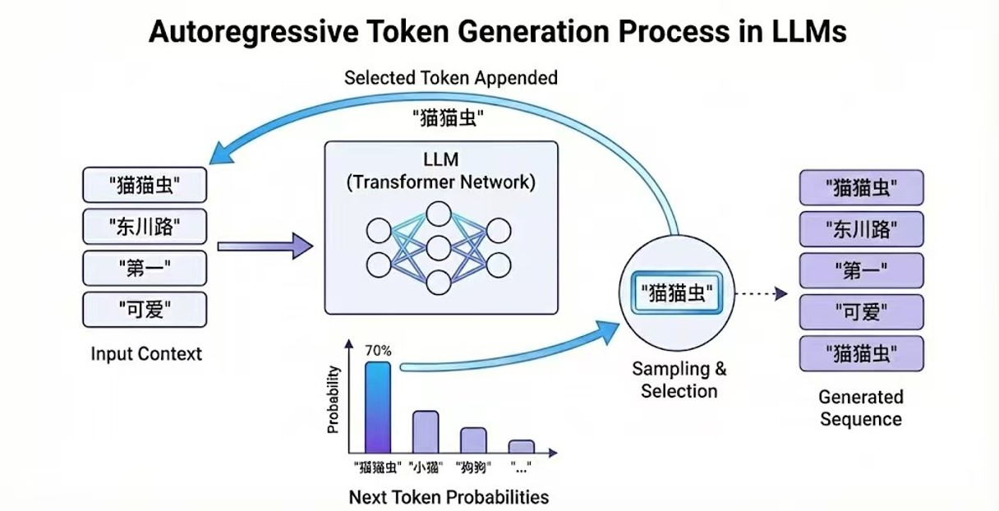
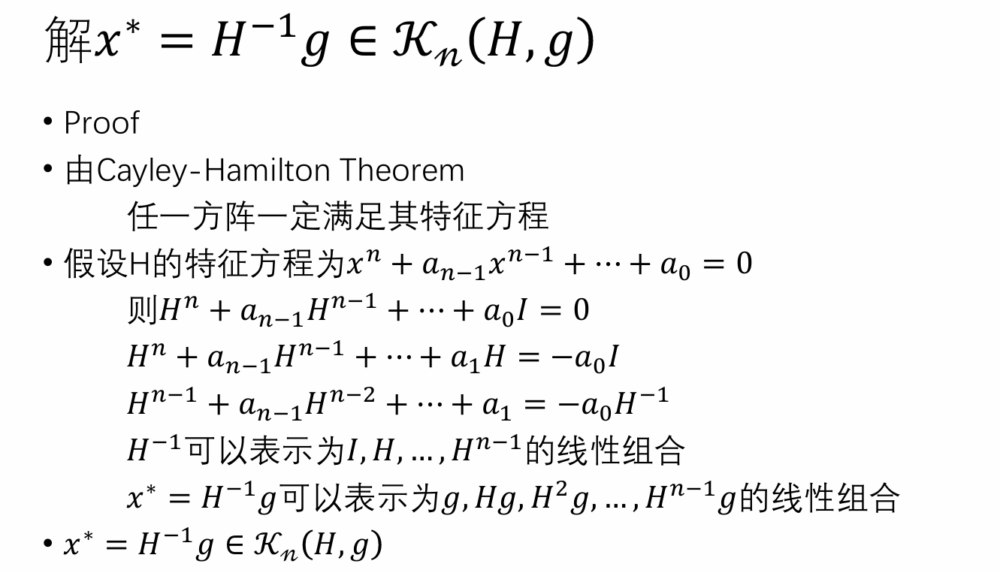
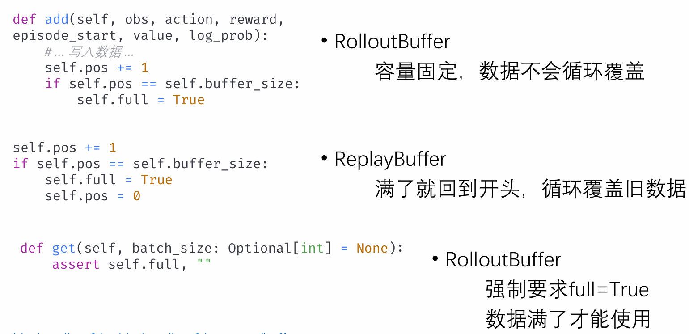

# 🧠 AI Algorithms Notes: Math & Implementation
# 人工智能算法笔记：从数学原理到代码实战

 

**Open Source Slides for AI Education.**

这里存放我 B站 视频教程的配套 **PPTX 课件 (可编辑)** 与 **PDF 格式**，也会有一些涉及到的代码。持续更新中...

*"Talk is cheap, show me the math."*

 

  <h3>✨ 内容速览：从原理到实战 (Highlights)</h3>
  
  <table width="100%" style="table-layout: fixed;">
    <tr>
      <td align="center" width="33%">
        
         
        🧠 原理清晰图示 (Conceptual Diagram)
      </td>

      <td align="center" width="33%">
        
         
        ✏️ 清晰数学推导 (Rigorous Math Derivation)
      </td>

      <td align="center" width="33%">
        
         
        💻 实战代码讲解 (Practical Code Walkthrough)
      </td>
    </tr>
  </table>

 
---

## 📂 1. 大模型基础与前沿 (LLM Architecture & Tuning)
> **Folder:** `./01_LLM_Base`
>
> 涵盖 Transformer 核心组件 (RoPE, KV Cache)、DeepSeek 前沿技术 (MLA, NSA) 以及 LoRA 微调的底层数学。

| Topic (点击观看视频)                                                                                                                    | Slides (Download) | Keywords |
|:----------------------------------------------------------------------------------------------------------------------------------| :--- | :--- |
| [**Attention & MHA**](https://www.bilibili.com/video/BV1QQp1z9Ezf/?spm_id_from=333.1387.upload.video_card.click)                  | [PPTX](./01_LLM_Base/Attention.pptx) \| [PDF](./01_LLM_Base/Attention.pdf) | `QKV` `Softmax` |
| [**RoPE 旋转位置编码**](https://www.bilibili.com/video/BV1vgpBzzEh5/?spm_id_from=333.1387.upload.video_card.click)                      | [PPTX](./01_LLM_Base/rope.pptx) \| [PDF](./01_LLM_Base/rope.pdf) | `Complex Number` `Extrapolation` |
| [**KV Cache 原理 (Part 1)**](https://www.bilibili.com/video/BV1EAp4z1EbJ/?spm_id_from=333.1387.upload.video_card.click)             | [PPTX](./01_LLM_Base/KV%20Cache(1).pptx) \| [PDF](./01_LLM_Base/KV%20Cache(1).pdf) | `Memory Optimization` |
| [**GQA, MQA 与 KV Cache (Part 2)**](https://www.bilibili.com/video/BV1yspRzPEw8/?spm_id_from=333.1387.upload.video_card.click)     | [PPTX](./01_LLM_Base/KV%20Cache(2).pptx) \| [PDF](./01_LLM_Base/KV%20Cache(2).pdf) | `Multi-Query` `Group-Query` |
| [**DeepSeek: Sparse Attention (DSA)**](https://www.bilibili.com/video/BV1iynyzXEKx/?spm_id_from=333.1387.upload.video_card.click) | [PPTX](./01_LLM_Base/DeepseekSparAtten.pptx) \| [PDF](./01_LLM_Base/DeepseekSparAtten.pdf) | `DeepSeek-V2` `Sparsity` |
| [**DeepSeek: NSA (Native Sparse)**](https://www.bilibili.com/video/BV14k4UzAEMu/?spm_id_from=333.1387.upload.video_card.click)    | [PPTX](./01_LLM_Base/NSA%20.pptx) \| [PDF](./01_LLM_Base/NSA%20.pdf) | `DeepSeek-V3` `Compression` |
| [**LoRA: 矩阵低秩近似数学基础**](https://www.bilibili.com/video/BV1X9pizaEgA/?spm_id_from=333.1387.upload.video_card.click)                 | [PPTX](./01_LLM_Base/Low-RankApprox.pptx) \| [PDF](./01_LLM_Base/Low-RankApprox.pdf) | `SVD` `Pseudo-Inverse` |
| [**LoRA: 反向传播与梯度计算**](https://www.bilibili.com/video/BV1kHJCzdEYY/?spm_id_from=333.1387.upload.video_card.click)                  | [PPTX](./01_LLM_Base/LoRA.pptx) \| [PDF](./01_LLM_Base/LoRA.pdf) | `Backprop` `Parameter Efficient` |
| [**LoRA: 初始化策略 (Init)**](https://www.bilibili.com/video/BV1YDngzDEgn/?spm_id_from=333.1387.upload.video_card.click)               | [PPTX](./01_LLM_Base/LoRA_initialization.pptx) \| [PDF](./01_LLM_Base/LoRA_initialization.pdf) | `Zero Init` `Gaussian` |
| [**信息论基础: 熵与KL散度**](https://www.bilibili.com/video/BV1JrCsBCE8D/?spm_id_from=333.1387.upload.video_card.click)                                                                                                             | [PPTX](./01_LLM_Base/entropy-KLdivg.pptx) \| [PDF](./01_LLM_Base/entropy-KLdivg.pdf) | `Shannon Entropy` `Cross-Entropy` |

---

## 🤖 2. 强化学习 (Reinforcement Learning)
> **Folder:** `./02_RL`
>
> 零基础入门强化学习！从经典的 Q-Learning 一直到 TRPO/PPO 的完整数学推导与代码实现细节，RLHF。

| Topic (点击观看视频)                                                                                                        | Slides (Download) | Keywords |
|:----------------------------------------------------------------------------------------------------------------------| :--- | :--- |
| [**零基础入门强化学习&Q-Learning**]()https://www.bilibili.com/video/BV1Cmx9zgEDy/?spm_id_from=333.1387.upload.video_card.click | [PPTX](./02_RL/RLfromScratch-Ql.pptx) \| [PDF](./02_RL/RLfromScratch-Ql.pdf) | `Bellman Equation` `Table-based` |
| [**DQN (Deep Q-Network)**](https://www.bilibili.com/video/BV1YexvzTE6V/?spm_id_from=333.1387.upload.video_card.click) | [PPTX](./02_RL/DQN.pptx) \| [PDF](./02_RL/DQN.pdf) | `Replay Buffer` `Target Net` |
| [**Policy Gradient (PG)**](https://www.bilibili.com/video/BV14Tx2zsEHo/?spm_id_from=333.1387.upload.video_card.click) | [PPTX](./02_RL/PolicyGradient.pptx) \| [PDF](./02_RL/PolicyGradient.pdf) | `REINFORCE` `Log_prob` |
| [**Actor-Critic (AC)**](https://www.bilibili.com/video/BV1vXWYzbE31/?spm_id_from=333.1387.upload.video_card.click)    | [PPTX](./02_RL/Actor-Critic.pptx) \| [PDF](./02_RL/Actor-Critic.pdf) | `Advantage` `TD Error` |
| [**TRPO: Part 1 理论推导**](https://www.bilibili.com/video/BV1DcWozHEYi/?spm_id_from=333.1387.upload.video_card.click)    | [PPTX](./02_RL/TRPO[1].pptx) \| [PDF](./02_RL/TRPO[1].pdf) | `Trust Region` `KL Constraint` |
| [**TRPO: Part 2 代码实现**](https://www.bilibili.com/video/BV1Ci1zBcEiz/?spm_id_from=333.1387.upload.video_card.click)    | [PPTX](./02_RL/TRPO[2].pptx) \| [PDF](./02_RL/TRPO[2].pdf) | `Line Search` |
| [**TRPO的数学原理: 共轭梯度法**](https://www.bilibili.com/video/BV1ZQxPzWEJd/?spm_id_from=333.1387.upload.video_card.click)                                                                                              | [PPTX](./02_RL/ConjugateGradient.pptx) \| [PDF](./02_RL/ConjugateGradient.pdf) | `Hessian-Vector Product` |
| [**PPO: Part 1 核心原理**](https://www.bilibili.com/video/BV1rVCcB1EDT/?spm_id_from=333.1387.upload.video_card.click)                                                                                              | [PPTX](./02_RL/PPO.pptx) \| [PDF](./02_RL/PPO.pdf) | `Clip` `Objective Function` |
| [**PPO: Part 2 完整实现&SB3代码解读**](https://www.bilibili.com/video/BV1KxSTBpEiW/?spm_id_from=333.1387.upload.video_card.click)                                                                                      | [PPTX](./02_RL/PPO-SB3.pptx) \| [PDF](./02_RL/PPO-SB3.pdf) | `Stable-Baselines3` `Implementation` |
| [**GAE (Generalized Advantage Est.)**](https://www.bilibili.com/video/BV1zKycBVEtc/?spm_id_from=333.1387.upload.video_card.click)                                                                              | [PPTX](./02_RL/GAE.pptx) \| [PDF](./02_RL/GAE.pdf) | `Bias-Variance Tradeoff` `Lambda` |

---

## 🛠️ 如何使用 (How to Use)

1.  **预览学习**：推荐直接点击表格中的 **PDF** 链接，GitHub 可以在线高清预览，适合手机/平板阅读。
2.  **组会/教学**：如果你需要修改课件用于组会汇报或学术分享，请下载 **PPTX** 源文件。
3.  **引用**：本仓库课件遵循 **CC BY-NC 4.0** 协议。引用时请注明来源：*Bilibili @东川路第一可爱猫猫虫*。

---

  ⭐ <b>如果对你有帮助，请给我一个 Star喵，感激不尽</b>
   
  If you find these slides helpful, please star this repository.

